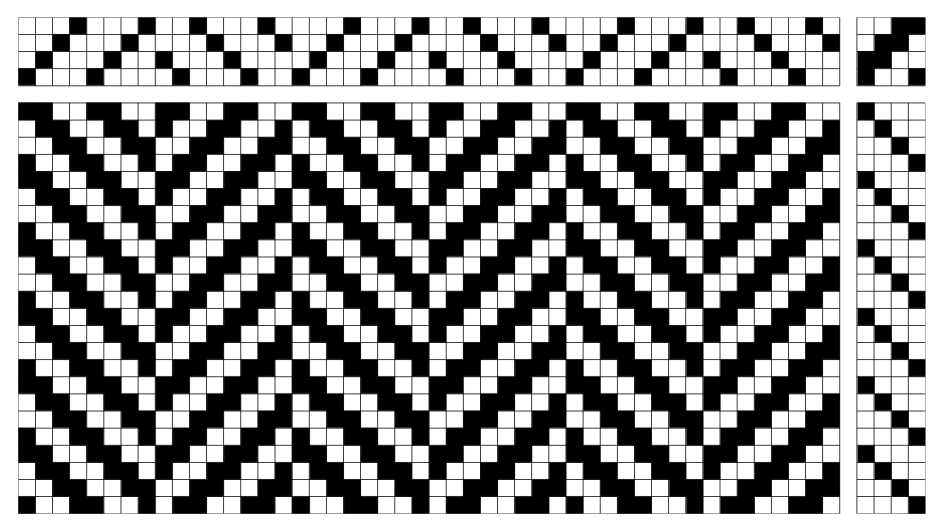

# Weaving draft generator for Python

`draftmaker.py` is a Python module written by Elizabeth Pankratz for generating weaving drafts like the one below, based on user-defined tie-up, threading, and treadling.




## How to use

To generate the example draft shown above (a 2x2 twill with herringbone threading and straight treadling), simply run `draftmaker.py`, e.g., by entering the following code on the command line:

```
python draftmaker.py
```

A window will pop up displaying this example draft, and a PDF version will also be saved to `sample_drafts/`.

For a more detailed tutorial walkthrough of the code (as well as a library of a few common weaving drafts), see [walkthrough.ipynb](walkthrough.ipynb).


## Requirements

This code uses Python 3 and the libraries `numpy`, `matplotlib`, and `skimage`.


## Limitations

The current version (of December 2022) only generates black/white drafts.
Future versions will eventually allow users to also specify colours for warp and weft.


## License

This work is licensed under a
[Creative Commons Attribution 4.0 International License][cc-by].

[![CC BY 4.0][cc-by-image]][cc-by]

[cc-by]: http://creativecommons.org/licenses/by/4.0/
[cc-by-image]: https://i.creativecommons.org/l/by/4.0/88x31.png
[cc-by-shield]: https://img.shields.io/badge/License-CC%20BY%204.0-lightgrey.svg